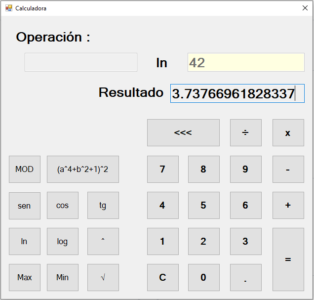

# Calculadora
Interfaz grafica de una Calculadora en C#, donde se puede realizar las operaciones basicas como suma(+), resta(-), multiplicacion(x) y division, ademas de potencia(^), raiz cuadrada, funciones tringonimetricas como el seno(sen), coseno(cos) y tangente(tg), logaritmo(log), logaritmo natural(ln), el maximo de dos numeros(MAX), el minimo de dos numeros(MIN), el modulo (MOD) y una la funcion: (a^4+b^1+1)^2. **27/09/20**

<strong>Imagen:</strong> Interfaz principal - Ln(42).

